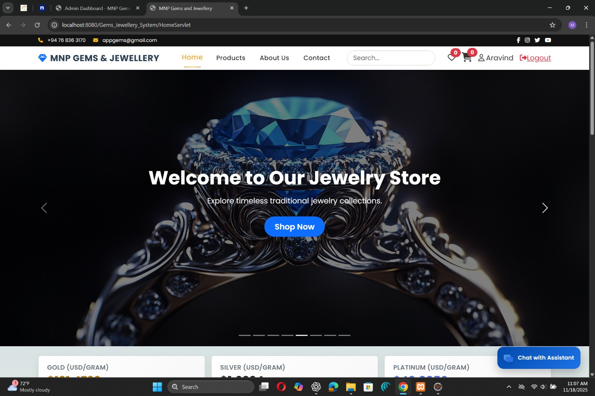

# 💎 Gems Jewellery System
*A Complete E-commerce Web Application for Jewellery Store Management*

Secure, database-driven web application built with **Java, JSP, Servlets, JDBC, Tomcat 9**, and **MySQL**. Enables customers to browse jewellery items, manage accounts, place orders, and provides comprehensive admin management.

## ✨ Features

### 👤 Customer Features
- 🔐 Secure User Registration & Login
- 🛍️ Browse Jewellery Products with Category Filtering
- 🔍 Advanced Product Search
- 🛒 Add to Cart & Checkout
- 📦 Order Placement & Tracking
- 👤 Profile Management

### 🔧 Admin Features
- 👑 Admin Dashboard
- ➕ Add/Edit/Delete Products
- 📂 Category Management
- 📋 View All Orders & Customers
- 📊 Inventory Management

### ⚙️ Technical Features
- MVC Architecture with DAO Pattern
- Session-based Authentication
- Input Validation & Exception Handling
- Responsive Design
- JDBC Database Connectivity

## 🛠️ Tech Stack

| Layer | Technology |
|-------|------------|
| **Frontend** | HTML5, CSS3, JSP, JSTL |
| **Backend** | Java 17, Servlets, JDBC |
| **Server** | Apache Tomcat 9 |
| **Database** | MySQL 8.0 (XAMPP) |
| **IDE** | Eclipse Enterprise |
| **Architecture** | MVC, DAO Pattern |

## 📱 Screenshots

### Customer Interface
| Home Page | Product Listing | Shopping Cart |
|-----------|-----------------|---------------|
|  |  |  |

| Checkout | User Profile |
|----------|--------------|
|  |  |

### Admin Dashboard
| Dashboard | Product Management | Order Management |
|-----------|--------------------|------------------|
|  |  |  |

## 📂 Project Structure
Gems_Jewellery_System/
├── src/
│ ├── controller/ # Servlet controllers
│ ├── dao/ # Data access objects
│ ├── model/ # POJO classes
│ └── util/ # DB connection & utilities
├── WebContent/
│ ├── css/ # Stylesheets
│ ├── js/ # JavaScript
│ ├── images/ # Product images
│ ├── jsp/ # JSP pages
│ └── WEB-INF/
│ └── web.xml
├── build/
├── .project
└── .classpath

text

## 🗄️ Database Schema
**Database:** `gems_jewellery_db`

| Table | Purpose |
|-------|---------|
| `users` | Customer accounts |
| `products` | Jewellery inventory |
| `categories` | Product categories |
| `orders` | Customer orders |
| `order_items` | Order line items |
| `admin` | Admin credentials |

**SQL dump included:** `database/gem_jewellery_db.sql`

## 🚀 Quick Start Guide

### 📦 1. Extract Project Files (WinRAR Required)
Project is split into multiple parts for GitHub compatibility.

Required Files:
├── Gems_Jewellery_System.zip
├── Gems_Jewellery_System.z01
├── Gems_Jewellery_System.z02
└── Gems_Jewellery_System.z03

text

**Steps:**
1. Download **ALL 4 files** to same folder
2. Right-click `Gems_Jewellery_System.zip` → **Extract Here**
3. WinRAR auto-combines all parts
4. Get complete `Gems_Jewellery_System/` folder

> ⚠️ **Never extract .z01/.z02 alone** - always use `.zip` file

### ⚙️ 2. Setup Environment
Extract project

Import to Eclipse (File → Import → Existing Projects)

Add Apache Tomcat 9 server

Start XAMPP → MySQL

Create gems_jewellery_db database

Import database/gem_jewellery_db.sql

text

### ▶️ 3. Run Application
Server: http://localhost:8080/Gems_Jewellery_System/

Customer Login: test@example.com / password123
Admin Login: admin@gems.com / admin123

text

## 🌐 Live Demo Setup (Optional)
For presentations/viva:

Terminal 1: Start ngrok
ngrok http 8080

Terminal 2: Run Tomcat
Share generated ngrok URL with examiners
text

## 🔒 Security Features
- Session-based authentication
- SQL Injection prevention
- Input sanitization
- Password hashing
- Role-based access control

## 📋 Default Credentials
| Role | Email | Password |
|------|-------|----------|
| Customer | test@example.com | password123 |
| Admin | admin@gems.com | admin123 |

## 🐛 Troubleshooting
| Issue | Solution |
|-------|----------|
| "Files corrupt" | Re-download ALL 4 parts |
| "ClassNotFound" | Check Tomcat libraries |
| "DB connection failed" | Verify XAMPP MySQL running |
| "404 Error" | Check project deployment on Tomcat |

## 👨‍💻 Author
**Chandrakumar Aravinda**  
*Software Engineer | Full-Stack Developer*

📧 [aravindan.saran2001@gmail.com](mailto:aravindan.saran2001@gmail.com)  
📍 Negombo, Sri Lanka  

---

⭐ **Star this repository if it helped you!**  
📄 **Licensed under MIT** | **© 2025 Chandrakumar Aravinda**
